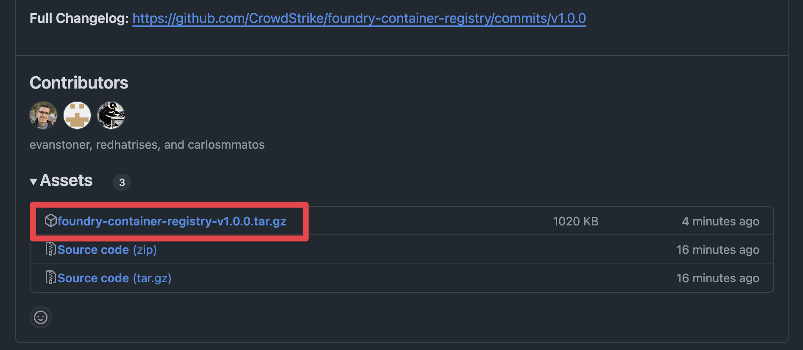
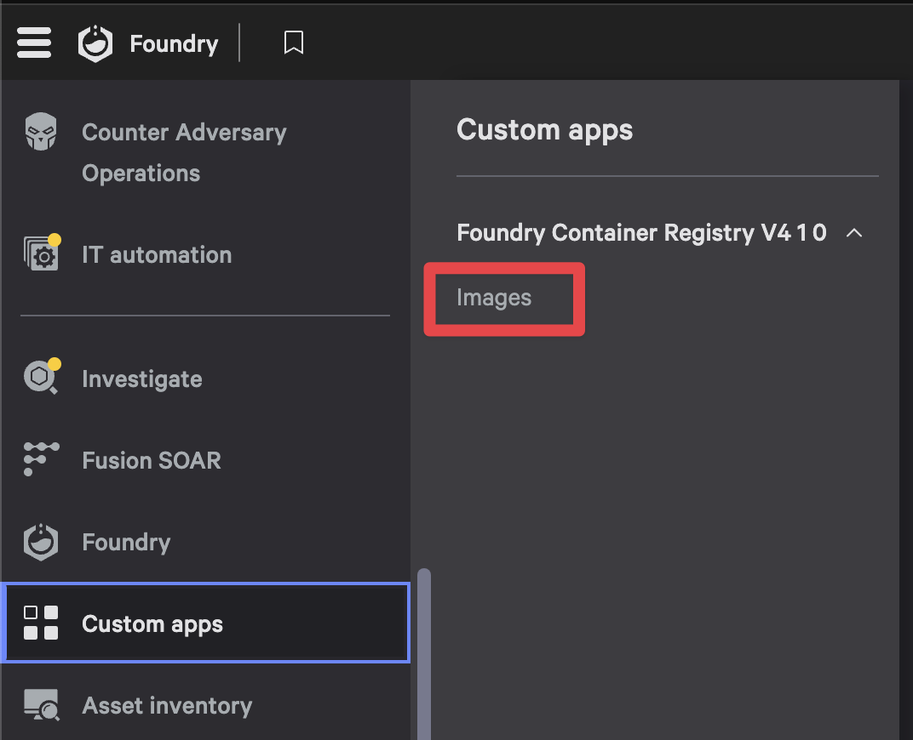

# Container Registry (Foundry app)

A Foundry application that provides a container registry interface for CrowdStrike's container images.

## Overview

[Brief description of what the application does and its key features]

## Installation

The application can be installed through Foundry's app import functionality. You'll need appropriate permissions in your Foundry environment to import and install the application.

### Requirements

- **Falcon Roles:**
  - Falcon Administrator
- **App Capabilities**
  - ***One or more of these subscriptions:***
    - Falcon Cloud Security with Containers
    - Falcon for Managed Containers

### Download the app

The Foundry app is exported as a release artifact upon creation of new releases. To download the app:

1. Navigate to the [**Releases**](https://github.com/CrowdStrike/foundry-container-registry/releases) page
1. Download the latest `foundry-container-registry-<version>.tar.gz` under **Assets**

1. Save the file to your local machine

### Import the app into Foundry

> [!WARNING]
> There are limitations to importing apps in Foundry:
> - You can't import multiple deployment versions of the same app
> - Editing an exported file before importing it can cause the file to become invalid. Instead of editing the exported file, edit the app after import.

1. On the Falcon console, navigate to ***Foundry*** -> ***Foundry*** -> ***App manager***
1. Click on ***Import app***

1. Click ***Upload file*** and select the downloaded `foundry-container-registry-<version>.tar.gz` file from the previous section
1. *(Optionally)* modify the app name
1. Click ***Import*** to complete the import process

> [!NOTE]
> A message is displayed when deployment begins, and another message is displayed when deployment is complete.
>
> The deployment is automatically assigned a type of Major, with a version of 1.0.0. The change log reads Major: App Imported.

### Release the app

Release a deployment version of the app to make it available for installation and use in your CID. To release the app:

1. In **App manager** click the **Open menu** (3 dots) for the deployment you want to release and select **Release** app

1. Select **Major** for change type, add any notes you would like to and click **Release**

This will take you to the **App overview** page after a successful release.

### Install the app

To install the Foundry app and make it available to your CID:

1. In the **App overview** page, select **View in app catalog** to navigate to the app catalog for the Container Registry app

1. Click **Install now** to start the installation process

1. The application permissions will be displayed. Review them and click **Save and install** to complete the installation

## Usage

Once the app has been installed, you can now access it via the **Custom apps** menu in the Falcon console:

1. Navigate to **Custom apps** and select **Images** to open the app

> [!NOTE]
> The first time you launch the app, you will need to click on the **Sync images now** button to fetch the latest data from the container registry and populate the app with data.

## Documentation

- [Developer Guide](docs/DEVELOPER.md)
- [Release and Deployment Process](docs/RELEASE.md)

## License

This project is licensed under the [MIT License](LICENSE)
