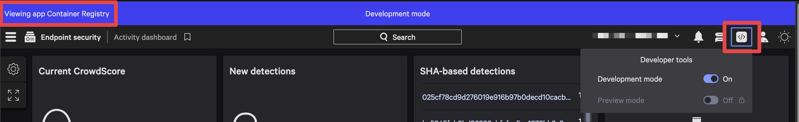
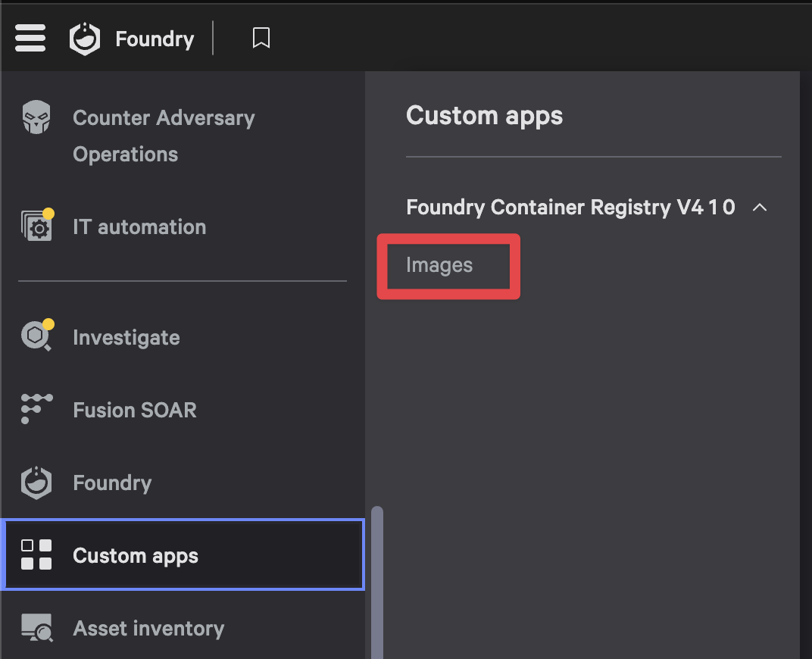

# Developer Guide

## Prerequisites

- Node.js 20.x or later
- npm
- Go 1.21 or later
- Foundry CLI
- A CrowdStrike Falcon API Client with appropriate permissions

## Development Workflow

### Testing UI pages in the console

> [!NOTE]
> Currently when working in **Development mode** you will be interacting with mock data instead of data coming from a collection.

1. In the Falcon console, make sure you enable **Development mode** under developer tools:
    

1. Set up the UI development environment:

    ```bash
    cd ui/pages
    npm install
    npm run watch    # Live rebuild on change
    ```

1. In the root directory (in a separate terminal), run:

    ```bash
    foundry apps run
    ```

1. Navigate to **Custom apps** and select **Images** to open the app


### Testing functions locally

Foundry functions don't have a "dev mode" so we test locally and then deploy.

#### Environment Setup

1. Configure your environment variables:

    ```bash
    export FALCON_CLIENT_ID="your-client-id"
    export FALCON_CLIENT_SECRET="your-client-secret"
    export FALCON_CLOUD="your-cloud"        # e.g., us-1, eu-1
    export DEBUG=true                       # Optional: Enable debug logging
    ```

2. Start the function server:

    ```bash
    cd functions/syncimages
    go run main.go
    ```

3. Test the function (in a separate terminal):

    ```bash
    curl -X POST --location 'http://localhost:8081' \
        --header 'Content-Type: application/json' \
        --data '{
            "body": {},
            "method": "POST",
            "url": "/sync-images"
        }'
    ```

## Previewing the app

To preview the Foundry app after making development changes, please refer to the [Release and Deployment Guide](./RELEASE.md#development-deployments).

## Troubleshooting

### Common Issues

1. **UI Not Updating**:
   1. Ensure Preview mode is enabled
   1. Try clearing browser cache
   1. Verify `npm run watch` is running

1. **Function testing failures**:
   1. Verify environment variables are set correctly
   1. Check API permissions
   1. Enable DEBUG mode for more detailed logs

### Debugging Tips

- Use browser developer tools for UI issues
- Check function logs with `DEBUG=true`

## Contributing

Visit the [Contributing Guide](./CONTRIBUTING.md) for detailed guidelines on how to contribute to the project.

## Additional Resources

- [Foundry Documentation](https://falcon.crowdstrike.com/login/?unilogin=true&next=/documentation/category/ae43a973/getting-started-with-foundry)
- [CrowdStrike Developer Portal](https://developer.crowdstrike.com/)
- [GoFalcon SDK](https://github.com/crowdstrike/gofalcon)
