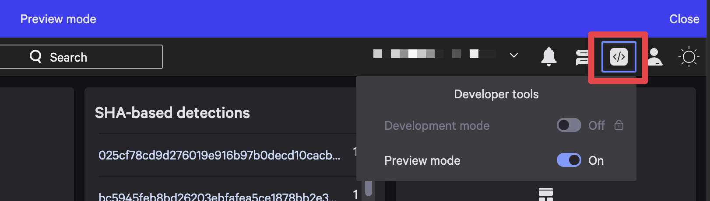

# Release and Deployment Guide

## Overview

This document outlines the processes for deploying development versions and releasing production versions of the Foundry Container Registry application.

A deployment represents a development version of the software. This development version can be promoted to production through a release process, making it available for installation. While Foundry supports semantic versioning for deployments, we do not utilize this feature. The release versions in this GitHub repository correspond to Foundry releases.

## Deployment Process

### Development Deployments

Deploy builds from either `main` or feature branches:

1. Build the application:

   ```bash
   make build
   ```

2. Deploy to Foundry:

   ```bash
   foundry apps deploy
   ```

3. During deployment:
   - Select "Patch" version (by convention)
   - Add a changelog or note "preparing for vX.Y.Z"
   - Preview and test the application
     - In the Falcon console, make sure you enable **Preview mode** under developer tools:
         

## Release Process

### Prerequisites

- All desired changes must be merged to `main`
- A successful deployment should be completed and tested
- Release permissions in both GitHub and Foundry

### Creating a Release

1. **Prepare the Release**
   - Ensure all desired PRs are merged to `main`
   - Complete a final deployment following the steps above
   - Review and test the deployment

2. **Create GitHub Release**
   - Create from `main` branch
   - Choose appropriate version number (X.Y.Z)
   - Generate and review changelog
   - Create the release

3. **Release in Foundry**

   ```bash
   foundry apps release
   ```

   - Choose version increment (major/minor/patch)
   - Version should align with GitHub release
   - Include GitHub release URL in release notes

### Version Numbering

- **Major (X.0.0)**: Breaking changes
- **Minor (0.X.0)**: New features, backwards compatible
- **Patch (0.0.X)**: Bug fixes, backwards compatible

> [!NOTE]
> Foundry generates the release version by incrementing the previous Foundry release version according to the selected increment type (major/minor/patch).

## Distribution Package

### GitHub Action (automated)

When a new release is created, a GitHub Action automatically builds and attaches the distribution package to the release as an artifact.

### Creating a Distribution Package (manually)

To create a package for distribution:

```bash
make package
```

This produces a `.tar.gz` file that can be imported to Foundry.

> [!IMPORTANT]
> When importing the package, Foundry creates a new app with deployment version 1.0.0.
